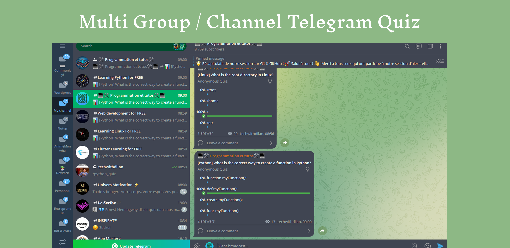

# 🤖 Tech Learning Quiz Telegram Bot 🧠

## 📚 Overview

This Telegram Bot is a dynamic, educational tool designed to help tech enthusiasts and learners improve their knowledge through interactive quizzes. Whether you're learning Flutter, Linux, Web Development, Python, or general programming, this bot has you covered! 



## ✨ Features

- 🎲 **Random Quiz Generation**: Get a random quiz from various tech categories
- 📊 **Multiple Categories**: Support for Flutter, Linux, Cybersecurity, Web Development, Python, and General Programming
- 🌐 **Multi-Channel Distribution**: Send quizzes to multiple Telegram channels and groups
- 💾 **Persistent Quiz Storage**: Quizzes are stored in a JSON file for easy management
- 🔧 **Flexible Quiz Management**: Easily add, modify, and expand quiz questions

## 🚀 Getting Started

### Prerequisites

- Python 3.7+
- pip package manager

### Installation

1. Clone the repository:
   ```bash
   git clone https://github.com/Nde-Dilan/telegram-tech-quiz-bot.git
   cd telegram-tech-quiz-bot
   ```

2. Install required dependencies:
   ```bash
   pip install python-telegram-bot nest_asyncio
   ```

3. Set up your Telegram Bot Token:
   - Create a new bot via BotFather on Telegram
   - Replace `BOT_TOKEN` in the script with your token
   - Set up environment variables or modify the script directly

### Configuration

- Modify `CHANNELS` and `GROUPS` lists in the `main()` function to add your desired Telegram channels and groups
- Optional: Customize the `quizzes.json` file with your own quiz questions

## 🎮 Usage

### Running the Bot

```bash
python quiz_bot.py
```

### Available Commands

- `/quiz`: Send a random quiz from any category
- `/flutter_quiz`: Send a Flutter-specific quiz
- `/linux_quiz`: Send a Linux-specific quiz
- `/webdevelopment_quiz`: Send a Web Development quiz
- `/python_quiz`: Send a Python-specific quiz
- And more!

## 📝 Adding New Quizzes

You can programmatically add quizzes using the `QuizManager` class:

```python
quiz_manager.add_quiz(
    category='flutter',
    question='What is the primary programming language used in Flutter?',
    options=['Java', 'Kotlin', 'Dart', 'Swift'],
    correct_option='Dart',
    explanation='Dart is the official programming language developed by Google for building Flutter applications.'
)
```

## 🤝 Contributing

1. Fork the repository
2. Create your feature branch (`git checkout -b feature/AmazingFeature`)
3. Commit your changes (`git commit -m 'Add some AmazingFeature'`)
4. Push to the branch (`git push origin feature/AmazingFeature`)
5. Open a Pull Request

## 🚧 Potential Improvements

- [ ] Add more quiz categories
- [ ] Deploy to AWS Lambda to make it available online
- [ ] Implement user score tracking
- [ ] Create a web interface for quiz management
- [ ] Add support for multiple languages

## 📄 License

Distributed under the MIT License. 

## 📞 Contact

NDE HURICH DILAN - [On WhatsApp](https://wa.me/237694525931)

Project Link: [https://github.com/Nde-Dilan/telegram-tech-quiz-bot](https://github.com/Nde-Dilan/telegram-tech-quiz-bot)

---

🌟 **Star this repository if you find it helpful!** 🌟